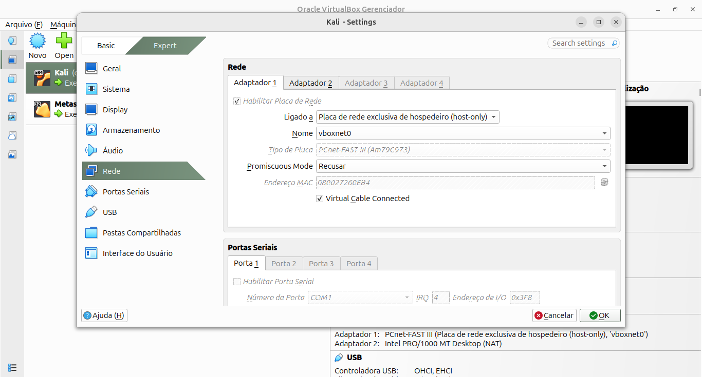
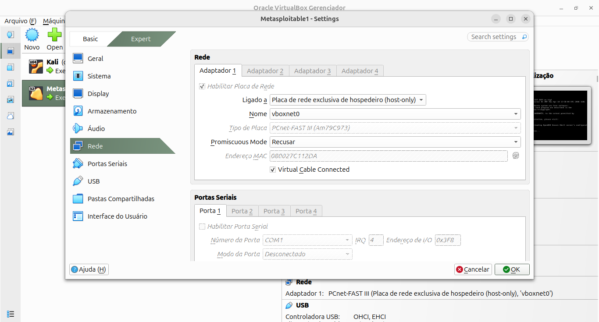
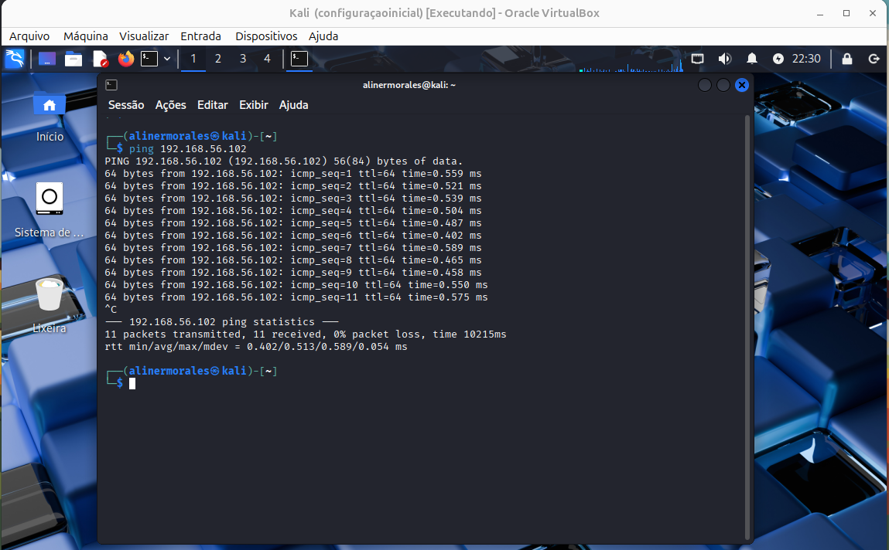
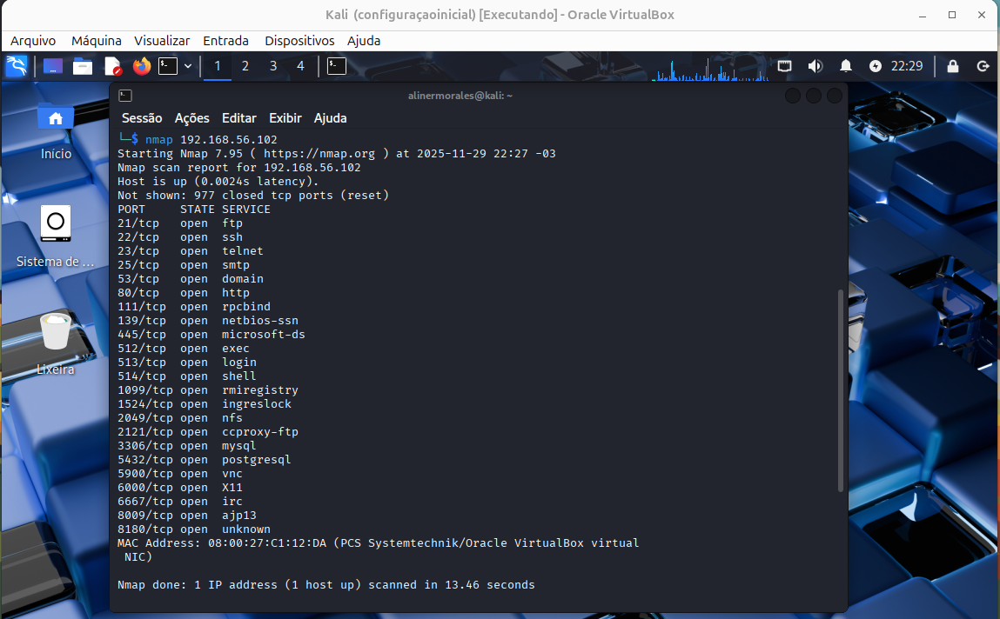
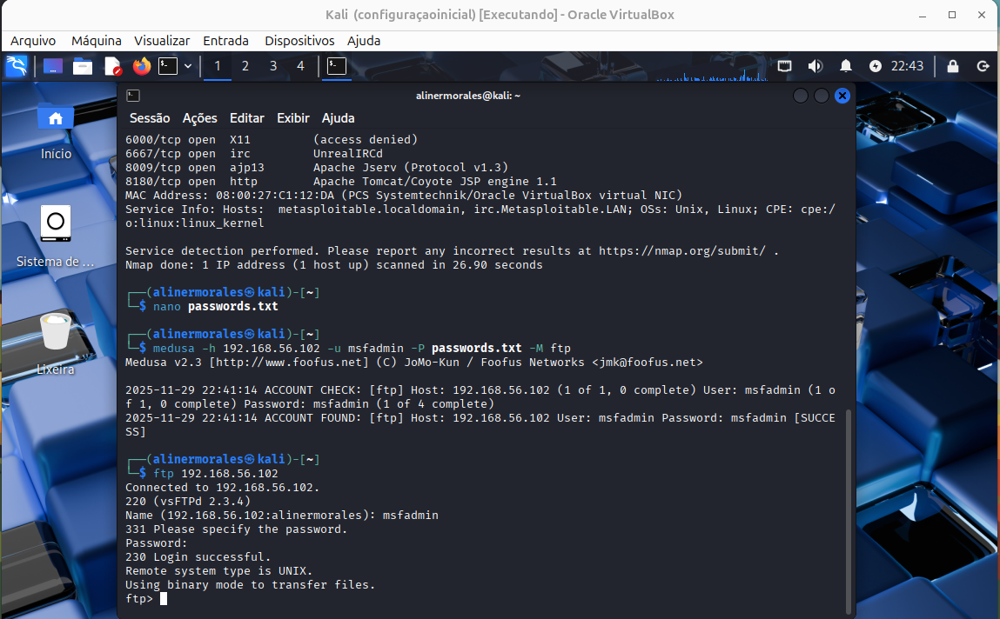

# Dio-Lab-Medusa
Simulação de ataque de força bruta com Medusa em ambiente controlado
## 🧪 1. Configuração do Ambiente

As máquinas Kali Linux (atacante) e Metasploitable 2 (alvo) foram configuradas
na mesma rede Host-Only, permitindo comunicação entre elas sem acesso à internet.

### 📌 Rede do Kali Linux

### 📌 Rede do Metasploitable

---

## 🧪 2. Testes de Conectividade

Verificação de conectividade entre as VMs utilizando ping.

---

## 🧪 3. Varredura de Serviços

Foi realizada varredura de portas e serviços com Nmap para identificar possíveis vetores de ataque.

---

## 🧪 4. Ataque de Força Bruta (FTP)

Foi utilizado o Medusa para simular ataque de força bruta no serviço FTP do Metasploitable,
resultando em acesso válido com credenciais fracas.
![Ataque de força bruta com medusa (FTP)] (images/medusa.png)

---

### ✅ Evidência de acesso obtido

## 🛠 Ferramentas Utilizadas

- *Kali Linux* – Sistema operacional utilizado como máquina atacante
- *Medusa* – Ferramenta para simulação de ataques de força bruta
- *Nmap* – Utilizado para varredura e enumeração de serviços
- *Metasploitable 2* – Máquina vulnerável utilizada como alvo dos testes
- *VirtualBox* – Plataforma de virtualização do ambiente

---

## 🛡️ Medidas de Mitigação

Para prevenir ataques de força bruta semelhantes, recomenda-se:

- Implementar políticas de senhas fortes
- Limitar tentativas de login
- Bloquear contas após tentativas falhas
- Utilizar autenticação multifator
- Monitorar logs de acesso
- Desativar serviços desnecessários

---

## ⚠️ Aviso Legal

Este projeto foi desenvolvido exclusivamente para fins educacionais,
em ambiente controlado, respeitando princípios éticos e legais da
segurança da informação.
